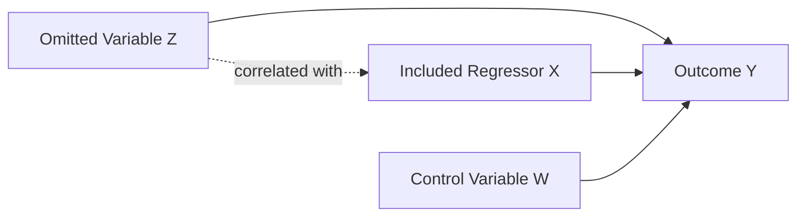
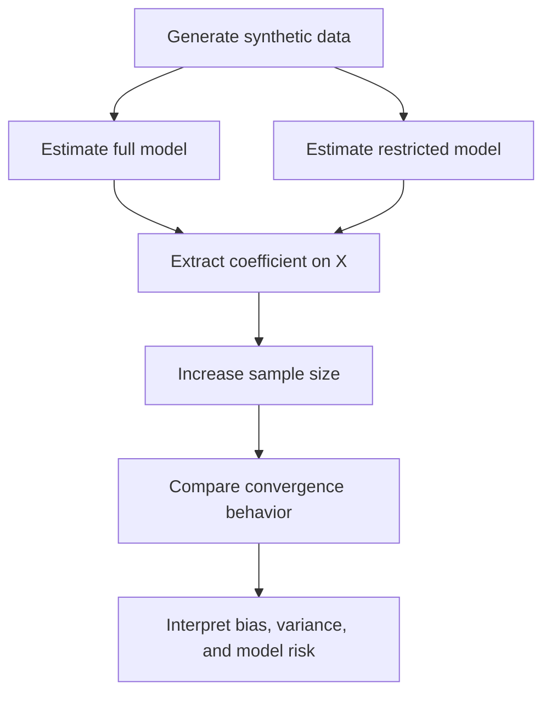

# Problem 1d — Omitted Variable Bias

<p align="center">
  <strong>Econometric Identification · Linear Regression · Financial Engineering · Mathematical Modeling · Model Risk</strong>
</p>

---

## Abstract

This project studies **omitted variable bias** as a structural identification problem in linear regression. The objective is to show that misspecification does not merely reduce explanatory power; it changes the statistical object estimated by ordinary least squares.

When a relevant explanatory variable is omitted and that variable is correlated with included regressors, the omitted variable becomes part of the regression disturbance. This creates endogeneity, violates the zero-conditional-mean assumption, and causes the restricted-model estimator to converge toward a biased probability limit.

The project combines mathematical derivation, econometric identification logic, simulation, and financial engineering interpretation. The central conclusion is:

> Increasing the sample size reduces sampling noise, but it does not correct structural misspecification.  
> A misspecified model can become more precise while remaining wrong.

---

## 1. Econometric Motivation

Regression coefficients are meaningful only when the estimated specification matches the target estimand. In empirical finance, economics, and engineering systems, a coefficient is often interpreted as a marginal effect, exposure, factor loading, or risk sensitivity. That interpretation is valid only under appropriate identification conditions.

Omitted variable bias occurs when a relevant variable is excluded from the model and the excluded variable is related to one or more included regressors. In this setting, the coefficient on the included regressor does not isolate a direct effect. Instead, it absorbs part of the influence of the missing variable.

This is not primarily a prediction problem. It is an identification problem.

---

## 2. True Data-Generating Process

Assume the true structural model is

$$
Y_i = \beta_0 + \beta_1 X_i + \beta_2 W_i + \delta Z_i + \varepsilon_i.
$$

where:

| Symbol | Interpretation |
|---|---|
| $Y_i$ | Outcome variable |
| $X_i$ | Main regressor of interest |
| $W_i$ | Observed control variable |
| $Z_i$ | Relevant omitted variable |
| $\varepsilon_i$ | Structural error term |
| $\beta_1$ | True partial effect of $X_i$ on $Y_i$ |
| $\delta$ | Structural effect of the omitted variable $Z_i$ |

The full model satisfies the identification condition

$$
E(\varepsilon_i | X_i, W_i, Z_i) = 0.
$$

Under this condition, ordinary least squares applied to the correctly specified model consistently estimates the structural coefficient $\beta_1$.

---

## 3. Restricted Misspecified Model

Suppose the estimated model omits $Z_i$:

$$
Y_i = \alpha_0 + \alpha_1 X_i + \alpha_2 W_i + u_i.
$$

Substituting the true model into the restricted specification gives

$$
u_i = \delta Z_i + \varepsilon_i.
$$

The omitted variable is now embedded in the error term. If the omitted variable is relevant and correlated with the included regressor after controlling for $W_i$, then the restricted disturbance is endogenous.

In linear projection terms, the problem occurs when

$$
\delta \neq 0
$$

and

$$
\mathrm{Cov}(\tilde X_i, \tilde Z_i) \neq 0,
$$

where $\tilde X_i$ and $\tilde Z_i$ denote the residualized components of $X_i$ and $Z_i$ after projecting them on the controls.

Thus,

$$
E(u_i | X_i, W_i) \neq 0.
$$

The restricted regression violates the exogeneity condition required for unbiased and consistent OLS estimation.

---

## 4. Identification Logic

The full-model coefficient $\beta_1$ estimates the partial effect of $X_i$ on $Y_i$, holding both $W_i$ and $Z_i$ fixed.

The restricted-model coefficient $\alpha_1$ estimates a different object. It captures the effect of $X_i$ while failing to condition on $Z_i$. As a result, $X_i$ partially proxies for the omitted explanatory channel.

Conceptually,

$$
\mathrm{plim}\,\hat{\alpha}_1
=
\beta_1
+
\mathrm{Bias}.
$$

Using the Frisch-Waugh-Lovell interpretation, let $\tilde X_i$ and $\tilde Z_i$ be the residuals from projecting $X_i$ and $Z_i$ on the included controls. Then the omitted-variable-bias expression is

$$
\mathrm{plim}\,\hat{\alpha}_1
=
\beta_1
+
\delta
\frac{\mathrm{E}(\tilde X_i \tilde Z_i)}
{\mathrm{E}(\tilde X_i^2)}.
$$

Therefore,

$$
\mathrm{Bias}
=
\delta
\frac{\mathrm{E}(\tilde X_i \tilde Z_i)}
{\mathrm{E}(\tilde X_i^2)}.
$$

This expression shows that the sign and magnitude of the bias are determined by two forces:

1. The structural importance of the omitted variable, $\delta$
2. The dependence between the omitted variable and the included regressor, conditional on the controls

If either $\delta = 0$ or $\mathrm{E}(\tilde X_i \tilde Z_i) = 0$, omitted variable bias disappears. Otherwise, the restricted estimator is inconsistent for the intended structural coefficient.

---

## 5. Matrix Representation

Let $R$ denote the matrix of included regressors, containing the intercept, $X$, and $W$.

The true model is

$$
y = R\theta + Z\delta + \varepsilon.
$$

The restricted model estimates

$$
y = R\alpha + u.
$$

The OLS estimator is

$$
\hat{\alpha}
=
(R^T R)^{-1}R^T y.
$$

Substituting the true model gives

$$
\hat{\alpha}
=
(R^T R)^{-1}R^T(R\theta + Z\delta + \varepsilon).
$$

Expanding,

$$
\hat{\alpha}
=
\theta
+
(R^T R)^{-1}R^T Z\delta
+
(R^T R)^{-1}R^T\varepsilon.
$$

Taking probability limits,

$$
\mathrm{plim}\,\hat{\alpha}
=
\theta
+
Q_{RR}^{-1}Q_{RZ}\delta.
$$

where

$$
Q_{RR}
=
\mathrm{plim}\left(\frac{R^T R}{n}\right)
$$

and

$$
Q_{RZ}
=
\mathrm{plim}\left(\frac{R^T Z}{n}\right).
$$

The restricted estimator is consistent for the structural parameter only when

$$
Q_{RZ}\delta = 0.
$$

This condition is restrictive. It requires either that the omitted variable has no structural effect or that the omitted variable is orthogonal to the included regressors.

---

## 6. Causal and Statistical Structure



The omitted variable $Z$ affects the outcome $Y$ and is correlated with the included regressor $X$. Because $Z$ is excluded from the estimated model, its effect enters the disturbance term. This contaminates the coefficient on $X$ and creates endogeneity.

---

## 7. Computational Experiment

The simulation is designed to separate sampling variability from structural misspecification.

The true coefficient on $X$ is

$$
\beta_1 = 1.0.
$$

The theoretical probability limit of the omitted-variable estimator is

$$
\mathrm{plim}\,\hat{\alpha}_1 = 1.6.
$$

The experiment compares two specifications:

| Model | Specification | Expected Asymptotic Behavior |
|---|---|---|
| Full model | Includes $X$, $W$, and $Z$ | Converges to the true structural coefficient |
| Restricted model | Omits $Z$ | Converges to the biased probability limit |

The purpose is to show that the omitted-variable model does not become correct as the sample grows. It becomes more stable around the wrong estimand.

---

## 8. Simulation Workflow



---

## 9. Python Implementation

```python
import numpy as np
import pandas as pd
import statsmodels.api as sm


def simulate_ovb(n: int, seed: int = 42) -> pd.DataFrame:
    """
    Simulate a linear regression design with omitted variable bias.

    Parameters
    ----------
    n:
        Sample size.
    seed:
        Random seed for reproducibility.

    Returns
    -------
    pd.DataFrame
        Simulated dataset containing Y, X, W, and Z.
    """
    rng = np.random.default_rng(seed)

    x = rng.normal(0.0, 1.0, n)
    w = rng.normal(0.0, 1.0, n)

    # Z is correlated with X, which creates the omitted-variable channel.
    z = 0.5 * x + rng.normal(0.0, 1.0, n)

    epsilon = rng.normal(0.0, 1.0, n)

    beta_0 = 0.0
    beta_x = 1.0
    beta_w = 0.5
    delta_z = 1.2

    y = beta_0 + beta_x * x + beta_w * w + delta_z * z + epsilon

    return pd.DataFrame(
        {
            "Y": y,
            "X": x,
            "W": w,
            "Z": z,
        }
    )


def estimate_models(data: pd.DataFrame) -> dict:
    """
    Estimate the correctly specified model and the omitted-variable model.
    """
    y = data["Y"]

    full_design = sm.add_constant(data[["X", "W", "Z"]])
    restricted_design = sm.add_constant(data[["X", "W"]])

    full_model = sm.OLS(y, full_design).fit()
    restricted_model = sm.OLS(y, restricted_design).fit()

    return {
        "full_beta_x": full_model.params["X"],
        "restricted_beta_x": restricted_model.params["X"],
        "full_model": full_model,
        "restricted_model": restricted_model,
    }


if __name__ == "__main__":
    for sample_size in [200, 10_000]:
        df = simulate_ovb(n=sample_size)
        results = estimate_models(df)

        print(f"Sample size: {sample_size}")
        print(f"Full model coefficient on X: {results['full_beta_x']:.6f}")
        print(f"Omitted-variable coefficient on X: {results['restricted_beta_x']:.6f}")
        print()
```

---

## 10. R Econometric Validation

```r
simulate_ovb <- function(n, seed = 42) {
  set.seed(seed)

  X <- rnorm(n)
  W <- rnorm(n)

  # Z is correlated with X.
  Z <- 0.5 * X + rnorm(n)

  epsilon <- rnorm(n)

  beta_0 <- 0.0
  beta_x <- 1.0
  beta_w <- 0.5
  delta_z <- 1.2

  Y <- beta_0 + beta_x * X + beta_w * W + delta_z * Z + epsilon

  data.frame(Y = Y, X = X, W = W, Z = Z)
}

data_200 <- simulate_ovb(200)
data_10000 <- simulate_ovb(10000)

full_200 <- lm(Y ~ X + W + Z, data = data_200)
restricted_200 <- lm(Y ~ X + W, data = data_200)

full_10000 <- lm(Y ~ X + W + Z, data = data_10000)
restricted_10000 <- lm(Y ~ X + W, data = data_10000)

summary(full_200)
summary(restricted_200)
summary(full_10000)
summary(restricted_10000)
```

---

## 11. Julia Numerical Modeling Sketch

```julia
using Random
using DataFrames
using GLM
using Statistics

function simulate_ovb(n::Int; seed::Int = 42)
    Random.seed!(seed)

    X = randn(n)
    W = randn(n)

    # Omitted variable correlated with X
    Z = 0.5 .* X .+ randn(n)

    epsilon = randn(n)

    beta_0 = 0.0
    beta_x = 1.0
    beta_w = 0.5
    delta_z = 1.2

    Y = beta_0 .+ beta_x .* X .+ beta_w .* W .+ delta_z .* Z .+ epsilon

    DataFrame(Y = Y, X = X, W = W, Z = Z)
end

data = simulate_ovb(10_000)

full_model = lm(@formula(Y ~ X + W + Z), data)
restricted_model = lm(@formula(Y ~ X + W), data)

println(coeftable(full_model))
println(coeftable(restricted_model))
```

---

## 12. SQL Result Storage

```sql
CREATE TABLE ovb_simulation_results (
    experiment_id INTEGER PRIMARY KEY,
    sample_size INTEGER NOT NULL,
    model_type TEXT NOT NULL,
    coefficient_x REAL NOT NULL,
    convergence_target REAL NOT NULL,
    interpretation TEXT NOT NULL
);

INSERT INTO ovb_simulation_results
(sample_size, model_type, coefficient_x, convergence_target, interpretation)
VALUES
(200, 'Full Model', 0.925568, 1.000000, 'Finite-sample estimate close to the true structural coefficient'),
(200, 'Omitted Variable Model', 1.481238, 1.600000, 'Biased estimate approaching the omitted-variable probability limit'),
(10000, 'Full Model', 1.002342, 1.000000, 'Large-sample convergence toward the true structural coefficient'),
(10000, 'Omitted Variable Model', 1.583250, 1.600000, 'Large-sample convergence toward the biased estimand');
```

---

## 13. Reproducible Execution

```bash
# Create a virtual environment
python -m venv .venv

# Activate the environment
source .venv/bin/activate

# Install required packages
pip install numpy pandas statsmodels matplotlib jupyter

# Run the notebook
jupyter notebook notebook/problem_1d_omitted_variable_bias.ipynb
```

---

## 14. Empirical Results

The simulation results are summarized below.

| Model | Sample Size | Estimated Coefficient on $X$ | Convergence Target |
|---|---:|---:|---:|
| Full model | 200 | 0.925568 | True coefficient: 1.000000 |
| Omitted-variable model | 200 | 1.481238 | Biased probability limit: 1.600000 |
| Full model | 10,000 | 1.002342 | True coefficient: 1.000000 |
| Omitted-variable model | 10,000 | 1.583250 | Biased probability limit: 1.600000 |

The correctly specified model converges toward the true structural coefficient. The omitted-variable model converges toward the biased probability limit.

The key statistical distinction is:

> Consistency under correct specification is not the same as precision under misspecification.

---

## 15. Statistical Interpretation

For the correctly specified model,

$$
\hat{\beta}_1 \to \beta_1
$$

in probability.

For the omitted-variable model,

$$
\hat{\alpha}_1 \to \beta_1 + \mathrm{Bias}
$$

in probability.

The restricted estimator is not inconsistent because the sample is small. It is inconsistent because the model targets the wrong probability limit.

This distinction is central in econometrics, financial engineering, and statistical learning. A model can produce stable, precise, and statistically significant estimates while still being structurally invalid.

---

## 16. Financial Engineering Relevance

Omitted variable bias is highly relevant in financial engineering because financial systems are driven by observed, partially observed, and latent state variables.

| Financial Context | Potential Omitted Variable | Consequence |
|---|---|---|
| Asset pricing | Missing risk factor | Misestimated factor exposure or premium |
| Return forecasting | Macro state variable | Biased predictive coefficient |
| Volatility modeling | Liquidity, leverage, or regime state | Misstated risk exposure |
| Credit modeling | Borrower quality or macro cycle | Distorted default-risk estimate |
| Execution modeling | Market depth or order flow | Incorrect transaction-cost inference |
| ESG and climate finance | Transition risk or carbon exposure | Mispriced sustainability risk |

In these settings, a coefficient may appear statistically reliable while reflecting a mixture of direct effects and omitted state-variable effects.

This is why financial engineering requires more than predictive accuracy. It requires:

- Economically justified factor selection  
- Specification discipline  
- Residual diagnostics  
- Robustness analysis  
- Sensitivity analysis  
- Interpretation under uncertainty  
- Awareness of latent risk channels  

---

## 17. Model Risk Interpretation

From a model-risk perspective, omitted variable bias is a form of **structural model risk**.

The danger is not random noise. The danger is systematic distortion.

A misspecified model may perform well in sample, produce narrow confidence intervals, and appear statistically convincing. However, if the omitted variable is economically meaningful and correlated with included regressors, the model embeds a false structural interpretation.

In financial decision systems, this can lead to:

- Mispriced assets  
- Incorrect hedging ratios  
- Underestimated risk exposure  
- Biased portfolio allocation  
- Misleading stress-test conclusions  
- Poor climate-risk or ESG-risk assessment  

The problem is therefore not only statistical. It is also economic, operational, and decision-critical.

---

## 18. Engineering Interpretation

From an engineering perspective, the omitted variable is an unmodeled system input.

The regression model attempts to represent a system with incomplete state information. If the missing input is correlated with observed inputs, the model assigns part of the missing input's effect to the wrong variable.

This can be understood as a failure of system boundary definition.

```text
Observed Model Boundary
├── X included
├── W included
└── Z excluded

True System Boundary
├── X included
├── W included
└── Z included

Result
└── The restricted model estimates behavior from an incomplete system representation.
```

In mathematical engineering terms, the model is not merely noisy. It is structurally incomplete.

---

## 19. Technical Deliverables

```text
problem-1d/
├── README.md
├── notebook/
│   └── problem_1d_omitted_variable_bias.ipynb
├── html/
│   └── problem_1d_omitted_variable_bias.html
├── figures/
│   └── coefficient_convergence.png
├── results/
│   └── simulation_summary.csv
└── src/
    └── ovb_simulation.py
```

---

## 20. Main Conclusion

This project demonstrates that omitted variable bias is a structural identification failure.

A restricted regression is valid only when omitted variables are either irrelevant or orthogonal to the included regressors. When a relevant correlated variable is excluded, the omitted variable enters the disturbance term, creates endogeneity, and causes the OLS estimator to converge to the wrong estimand.

The main lesson is:

> Large datasets do not rescue structurally invalid models.  
> They only make the wrong estimate look more precise.

This principle is fundamental in financial engineering, where model specification, factor selection, and interpretation under uncertainty are central to reliable quantitative decision-making.

---

## Author

**Dossiya Dakou**  
MSc Financial Engineering — WorldQuant University  
Master of Science in Engineering, Sustainable Engineering — Arizona State University
