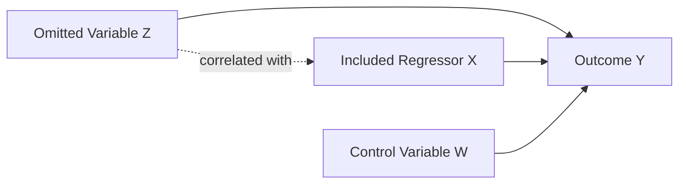
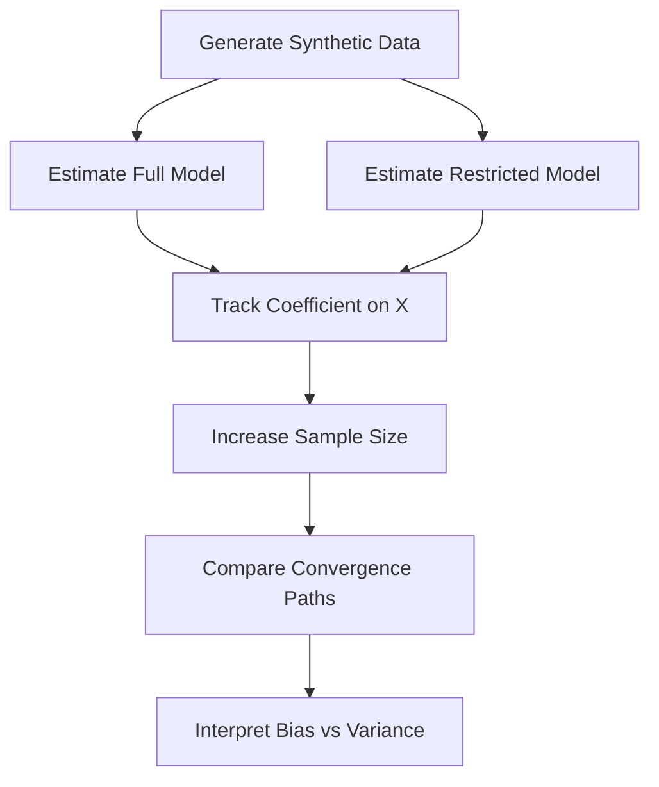

# Problem 1d — Omitted Variable Bias

<p align="center">
  <strong>Econometric Identification · Linear Regression · Financial Engineering · Statistical Learning</strong>
</p>

---

## Executive Summary

This project analyzes **omitted variable bias** as a structural identification failure in linear regression.

The central issue is not simply that a relevant explanatory variable is missing. The deeper econometric problem is that excluding a relevant variable changes the stochastic structure of the regression disturbance. When the omitted variable is correlated with included regressors, the error term becomes endogenous, violating the zero-conditional-mean assumption required for unbiased and consistent ordinary least squares estimation.

The project combines:

- Mathematical derivation  
- Econometric identification logic  
- Controlled simulation  
- Statistical convergence analysis  
- Financial engineering interpretation  

The core result is clear:

> More data reduce sampling variance, but they do not correct structural misspecification.  
> A misspecified model converges more precisely toward the wrong estimand.

---

## 1. Econometric Motivation

In empirical finance, economics, and engineering systems, regression models are often used to estimate structural relationships. However, a regression coefficient has a valid interpretation only when the model is correctly specified relative to the target estimand.

Omitted variable bias occurs when a relevant explanatory variable is excluded from the model and that omitted variable is statistically related to one or more included regressors.

In that case, the estimated coefficient no longer represents a clean partial effect. Instead, it combines:

1. The direct effect of the included regressor  
2. The indirect effect of the omitted variable that is correlated with the included regressor  

This is an identification problem, not merely a prediction problem.

---

## 2. True Data-Generating Process

Assume the true structural model is

$$
Y_i = \beta_0 + \beta_1 X_i + \beta_2 W_i + \delta Z_i + \varepsilon_i.
$$

where:

| Symbol | Interpretation |
|---|---|
| $Y_i$ | Outcome variable |
| $X_i$ | Main regressor of interest |
| $W_i$ | Additional observed control variable |
| $Z_i$ | Relevant omitted variable |
| $\varepsilon_i$ | Structural error term |
| $\beta_1$ | True partial effect of $X_i$ on $Y_i$ |
| $\delta$ | Structural effect of the omitted variable $Z_i$ |

The identifying condition for ordinary least squares in the full model is

$$
E(\varepsilon_i \mid X_i, W_i, Z_i) = 0.
$$

Under this condition, the full model can recover the structural coefficient $\beta_1$ consistently.

---

## 3. Misspecified Restricted Model

Now suppose the researcher estimates a restricted model that omits $Z_i$:

$$
Y_i = \alpha_0 + \alpha_1 X_i + \alpha_2 W_i + u_i.
$$

Substituting the true model into the restricted model gives the composite disturbance:

$$
u_i = \delta Z_i + \varepsilon_i.
$$

The omitted variable is now part of the error term.

If

$$
\mathrm{Cov}(X_i, Z_i) \neq 0,
$$

then

$$
\mathrm{Cov}(X_i, u_i) \neq 0,
$$

because

$$
\mathrm{Cov}(X_i, u_i)
=
\mathrm{Cov}(X_i, \delta Z_i + \varepsilon_i)
=
\delta \mathrm{Cov}(X_i, Z_i)
+
\mathrm{Cov}(X_i, \varepsilon_i).
$$

Assuming the structural error is exogenous,

$$
\mathrm{Cov}(X_i, \varepsilon_i) = 0,
$$

so the endogeneity arises from

$$
\mathrm{Cov}(X_i, u_i)
=
\delta \mathrm{Cov}(X_i, Z_i).
$$

Therefore, when both conditions hold,

$$
\delta \neq 0
$$

and

$$
\mathrm{Cov}(X_i, Z_i) \neq 0,
$$

the restricted model violates the OLS exogeneity condition.

---

## 4. Identification Logic

The full-model coefficient $\beta_1$ estimates the partial effect of $X_i$ on $Y_i$, holding $W_i$ and $Z_i$ fixed.

The restricted-model coefficient $\alpha_1$ estimates a different object. It captures the effect of $X_i$ while failing to hold $Z_i$ fixed. As a result, the omitted variable creates a statistical channel through which $X_i$ proxies for part of $Z_i$.

Conceptually,

$$
\mathrm{plim}\,\hat{\alpha}_1
=
\beta_1
+
\mathrm{Bias}.
$$

The bias term depends on two forces:

1. The structural relevance of the omitted variable, $\delta$
2. The dependence structure between $X_i$ and $Z_i$

In the simple one-regressor case, the omitted variable bias formula is

$$
\mathrm{plim}\,\hat{\alpha}_1
=
\beta_1
+
\delta
\frac{\mathrm{Cov}(X_i, Z_i)}{\mathrm{Var}(X_i)}.
$$

Therefore,

$$
\mathrm{Bias}
=
\delta
\frac{\mathrm{Cov}(X_i, Z_i)}{\mathrm{Var}(X_i)}.
$$

This expression shows that the direction and magnitude of the bias are determined jointly by the omitted variable's effect and its covariance with the included regressor.

---

## 5. Matrix Representation

Using matrix notation, let the true model be

$$
y = X\beta + Z\delta + \varepsilon,
$$

but suppose the researcher estimates

$$
y = X\alpha + u.
$$

The OLS estimator in the restricted model is

$$
\hat{\alpha}
=
(X^{\top}X)^{-1}X^{\top}y.
$$

Substituting the true model gives

$$
\hat{\alpha}
=
(X^{\top}X)^{-1}X^{\top}(X\beta + Z\delta + \varepsilon).
$$

Expanding,

$$
\hat{\alpha}
=
\beta
+
(X^{\top}X)^{-1}X^{\top}Z\delta
+
(X^{\top}X)^{-1}X^{\top}\varepsilon.
$$

Taking probability limits,

$$
\mathrm{plim}\,\hat{\alpha}
=
\beta
+
Q_{XX}^{-1}Q_{XZ}\delta,
$$

where

$$
Q_{XX}
=
\mathrm{plim}\left(\frac{X^{\top}X}{n}\right)
$$

and

$$
Q_{XZ}
=
\mathrm{plim}\left(\frac{X^{\top}Z}{n}\right).
$$

Thus, omitted variable bias disappears only when

$$
Q_{XZ}\delta = 0.
$$

This can happen if either:

1. The omitted variable has no structural effect: $\delta = 0$
2. The omitted variable is orthogonal to the included regressors: $Q_{XZ} = 0$

Outside these special cases, the restricted estimator is inconsistent for the structural parameter.

---

## 6. Causal and Statistical Structure



The omitted variable $Z$ affects the outcome $Y$ and is correlated with the included regressor $X$. Because $Z$ is not included in the estimated model, its effect enters the disturbance term. This creates endogeneity and contaminates the estimated coefficient on $X$.

---

## 7. Computational Experiment

The simulation is designed to separate two concepts:

1. **Sampling variation** — random error due to finite sample size  
2. **Structural misspecification** — persistent bias caused by omitting a relevant correlated variable  

The true coefficient on $X$ is set to

$$
\beta_1 = 1.0.
$$

The theoretical probability limit of the omitted-variable estimator is

$$
\mathrm{plim}\,\hat{\alpha}_1 = 1.6.
$$

The experiment compares:

| Model | Specification | Expected Behavior |
|---|---|---|
| Full model | Includes $X$, $W$, and $Z$ | Converges to the true coefficient |
| Restricted model | Omits $Z$ | Converges to the biased probability limit |

---

## 8. Simulation Workflow



The simulation increases the sample size from a smaller sample to a large sample. This allows the analysis to show that the full model converges toward the true structural coefficient, while the omitted-variable model converges toward a biased estimand.

---

## 9. Python Implementation Sketch

```python
import numpy as np
import pandas as pd
import statsmodels.api as sm


def simulate_omitted_variable_bias(n: int, seed: int = 42) -> pd.DataFrame:
    """
    Simulate a linear regression setting with omitted variable bias.

    Parameters
    ----------
    n : int
        Sample size.
    seed : int
        Random seed for reproducibility.

    Returns
    -------
    pd.DataFrame
        Simulated dataset containing Y, X, W, and Z.
    """
    rng = np.random.default_rng(seed)

    x = rng.normal(0, 1, n)
    w = rng.normal(0, 1, n)

    # Z is correlated with X, creating the omitted-variable channel.
    z = 0.5 * x + rng.normal(0, 1, n)

    epsilon = rng.normal(0, 1, n)

    beta_0 = 0.0
    beta_x = 1.0
    beta_w = 0.5
    delta_z = 1.2

    y = beta_0 + beta_x * x + beta_w * w + delta_z * z + epsilon

    return pd.DataFrame(
        {
            "Y": y,
            "X": x,
            "W": w,
            "Z": z,
        }
    )


def estimate_models(df: pd.DataFrame) -> dict:
    """
    Estimate the correctly specified model and the omitted-variable model.
    """
    y = df["Y"]

    X_full = sm.add_constant(df[["X", "W", "Z"]])
    X_restricted = sm.add_constant(df[["X", "W"]])

    full_model = sm.OLS(y, X_full).fit()
    restricted_model = sm.OLS(y, X_restricted).fit()

    return {
        "full_beta_x": full_model.params["X"],
        "restricted_beta_x": restricted_model.params["X"],
        "full_model": full_model,
        "restricted_model": restricted_model,
    }


for n in [200, 10_000]:
    data = simulate_omitted_variable_bias(n=n)
    results = estimate_models(data)

    print(f"Sample size: {n}")
    print(f"Full model coefficient on X: {results['full_beta_x']:.6f}")
    print(f"Omitted-variable model coefficient on X: {results['restricted_beta_x']:.6f}")
    print()
```

---

## 10. R Econometrics Implementation Sketch

```r
simulate_ovb <- function(n, seed = 42) {
  set.seed(seed)

  X <- rnorm(n)
  W <- rnorm(n)

  # Z is correlated with X.
  Z <- 0.5 * X + rnorm(n)

  epsilon <- rnorm(n)

  beta_0 <- 0.0
  beta_x <- 1.0
  beta_w <- 0.5
  delta_z <- 1.2

  Y <- beta_0 + beta_x * X + beta_w * W + delta_z * Z + epsilon

  data.frame(Y = Y, X = X, W = W, Z = Z)
}

data_200 <- simulate_ovb(200)
data_10000 <- simulate_ovb(10000)

full_model_200 <- lm(Y ~ X + W + Z, data = data_200)
restricted_model_200 <- lm(Y ~ X + W, data = data_200)

full_model_10000 <- lm(Y ~ X + W + Z, data = data_10000)
restricted_model_10000 <- lm(Y ~ X + W, data = data_10000)

summary(full_model_200)
summary(restricted_model_200)
summary(full_model_10000)
summary(restricted_model_10000)
```

---

## 11. SQL-Style Result Storage

```sql
CREATE TABLE ovb_simulation_results (
    experiment_id INTEGER PRIMARY KEY,
    sample_size INTEGER NOT NULL,
    model_type TEXT NOT NULL,
    coefficient_x REAL NOT NULL,
    convergence_target REAL NOT NULL,
    interpretation TEXT
);

INSERT INTO ovb_simulation_results
(sample_size, model_type, coefficient_x, convergence_target, interpretation)
VALUES
(200, 'Full Model', 0.925568, 1.000000, 'Finite-sample estimate close to true coefficient'),
(200, 'Omitted Variable Model', 1.481238, 1.600000, 'Biased estimate approaching omitted-variable probability limit'),
(10000, 'Full Model', 1.002342, 1.000000, 'Large-sample convergence to true structural coefficient'),
(10000, 'Omitted Variable Model', 1.583250, 1.600000, 'Large-sample convergence to biased estimand');
```

---

## 12. Reproducible Project Execution

```bash
# Create environment
python -m venv .venv

# Activate environment
source .venv/bin/activate

# Install dependencies
pip install numpy pandas statsmodels matplotlib seaborn jupyter

# Run notebook
jupyter notebook notebook/problem_1d_omitted_variable_bias.ipynb
```

---

## 13. Empirical Results

| Model | Sample Size | Estimated Coefficient on $X$ | Convergence Target |
|---|---:|---:|---:|
| Full model | 200 | 0.925568 | True coefficient: 1.000000 |
| Omitted-variable model | 200 | 1.481238 | Biased probability limit: 1.600000 |
| Full model | 10,000 | 1.002342 | True coefficient: 1.000000 |
| Omitted-variable model | 10,000 | 1.583250 | Biased probability limit: 1.600000 |

The correctly specified model converges toward the true structural coefficient. The omitted-variable model converges toward the biased probability limit.

This demonstrates the key statistical distinction:

> Consistency under correct specification is not the same as precision under misspecification.

---

## 14. Statistical Interpretation

The simulation provides a clean demonstration of consistency.

For the correctly specified model,

$$
\hat{\beta}_1 \to_p \beta_1.
$$

For the omitted-variable model,

$$
\hat{\alpha}_1 \to_p \beta_1 + \mathrm{Bias}.
$$

Therefore, the restricted estimator is not inconsistent because the sample is too small. It is inconsistent because the model targets the wrong probability limit.

This distinction is central in applied econometrics, financial engineering, and data science. A model can produce stable, precise, and statistically significant estimates while still being structurally invalid.

---

## 15. Financial Engineering Relevance

Omitted variable bias is highly relevant in financial engineering because financial systems are driven by partially observed and latent state variables.

Examples include:

| Financial Context | Potential Omitted Variable | Consequence |
|---|---|---|
| Asset pricing | Missing risk factor | Misestimated factor premium |
| Return forecasting | Macro state variable | Biased predictive coefficient |
| Volatility modeling | Liquidity or leverage condition | Misstated risk exposure |
| Credit modeling | Borrower quality or macro cycle | Distorted default-risk estimate |
| Execution modeling | Market depth or order flow | Incorrect transaction-cost inference |
| ESG and climate finance | Transition risk or carbon exposure | Mispriced sustainability risk |

In each case, the coefficient of interest may appear statistically reliable while actually reflecting a mixture of direct effects and omitted state-variable effects.

This is why financial engineering requires more than predictive accuracy. It also requires:

- Factor justification  
- Specification testing  
- Economic interpretation  
- Residual diagnostics  
- Robustness analysis  
- Sensitivity checks  
- Awareness of latent risk channels  

---

## 16. Model Risk Interpretation

From a model-risk perspective, omitted variable bias is a form of **structural model risk**.

The danger is not random noise. The danger is systematic distortion.

A misspecified model may perform well in-sample, produce narrow confidence intervals, and appear statistically convincing. However, if the omitted variable is economically meaningful and correlated with included regressors, the model embeds a false causal or structural interpretation.

In financial decision systems, this can lead to:

- Mispriced assets  
- Incorrect hedging ratios  
- Underestimated risk exposure  
- Biased portfolio allocation  
- Misleading stress-test conclusions  
- Poor climate-risk or ESG-risk assessment  

---

## 17. Engineering Interpretation

From an engineering perspective, the omitted variable is an unmodeled system input.

The regression model attempts to represent a system with incomplete state information. If the missing input is correlated with observed inputs, the model assigns part of the missing input's effect to the wrong variable.

This is analogous to a measurement or control system in which an unobserved driver contaminates the signal assigned to a measured input.

Thus, omitted variable bias can be understood as a failure of system boundary definition.

```text
Observed System Boundary
├── X included
├── W included
└── Z excluded

True System Boundary
├── X included
├── W included
└── Z included

Result:
The restricted model estimates behavior from an incomplete system representation.
```

---

## 18. Technical Deliverables

```text
problem-1d/
├── README.md
├── notebook/
│   └── problem_1d_omitted_variable_bias.ipynb
├── html/
│   └── problem_1d_omitted_variable_bias.html
├── figures/
│   └── coefficient_convergence.png
├── results/
│   └── simulation_summary.csv
└── src/
    └── ovb_simulation.py
```

---

## 19. Main Conclusion

This project shows that omitted variable bias is a structural identification failure.

A restricted regression is valid only when omitted variables are either irrelevant or orthogonal to included regressors. When a relevant correlated variable is excluded, the omitted variable enters the error term, creates endogeneity, and causes the OLS estimator to converge to the wrong estimand.

The main lesson is:

> Large datasets do not rescue structurally invalid models.  
> They only make the wrong estimate look more precise.

This principle is fundamental in financial engineering, where model specification, factor selection, and interpretation under uncertainty are central to reliable quantitative decision-making.

---

## Author

**Dossiya Dakou**  
MSc Financial Engineering — WorldQuant University  
Master of Science in Engineering, Sustainable Engineering — Arizona State University
