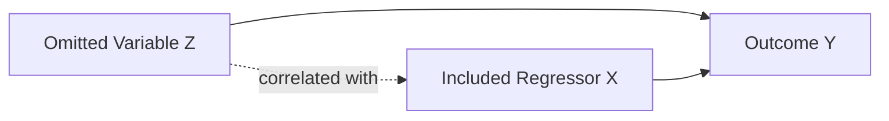
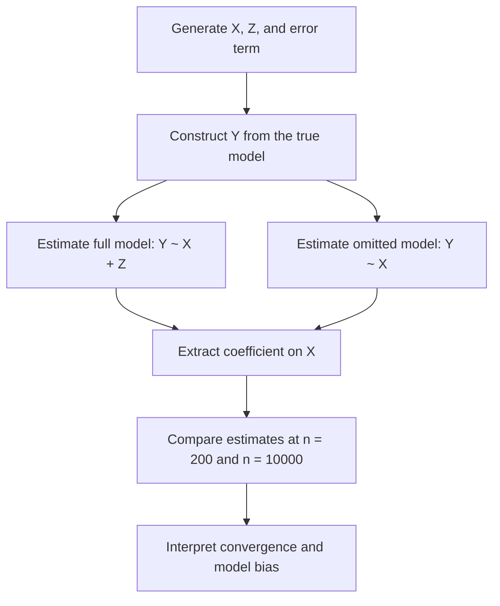

# Problem 1d — Omitted Variable Bias

<p align="center">
  <strong>Econometric Identification · Linear Regression · Financial Engineering · Mathematical Modeling · Model Risk</strong>
</p>

---

## Abstract

This project studies **omitted variable bias** as a structural identification problem in linear regression. The objective is to show that misspecification does not merely reduce explanatory power; it changes the statistical object estimated by ordinary least squares.

The notebook simulates a known data-generating process in which an omitted variable is both structurally relevant and correlated with the included regressor. The correctly specified model includes both explanatory variables, while the misspecified model excludes one of them. The simulation shows that the omitted-variable model does not converge to the true coefficient as the sample size increases. Instead, it converges toward a biased probability limit.

The central result is:

> Larger datasets reduce sampling noise, but they do not correct structural misspecification.  
> A misspecified model can become more precise while remaining wrong.

---

## 1. Econometric Motivation

Regression coefficients are meaningful only when the estimated specification is aligned with the target estimand. In empirical finance, economics, and engineering systems, a coefficient is often interpreted as a marginal effect, exposure, factor loading, or risk sensitivity. That interpretation is valid only under appropriate identification conditions.

Omitted variable bias occurs when a relevant explanatory variable is excluded from the model and that excluded variable is correlated with an included regressor.

In that setting, the coefficient on the included regressor does not isolate the direct effect of that regressor. Instead, it absorbs part of the influence of the missing variable. This is not mainly a small-sample problem or a prediction problem. It is an **identification problem**.

---

## 2. True Data-Generating Process

The notebook simulates the structural model

$$Y_i = a + bX_i + cZ_i + e_i.$$

where:

| Symbol | Interpretation |
|---|---|
| $Y_i$ | Outcome variable |
| $X_i$ | Included regressor of interest |
| $Z_i$ | Relevant explanatory variable |
| $e_i$ | Exogenous random error |
| $a$ | Intercept |
| $b$ | True coefficient on $X_i$ |
| $c$ | True coefficient on $Z_i$ |

The simulation parameters are:

$$a = 1,\quad b = 1,\quad c = 1.$$

Therefore, the true coefficient on $X_i$ is:

$$b = 1.$$

The omitted variable $Z_i$ is constructed to be correlated with $X_i$:

$$Z_i = \rho X_i + \sqrt{1-\rho^2}u_i.$$

The correlation parameter is:

$$\rho = 0.6.$$

The random variables are generated as:

$$X_i \sim N(0,1),\quad u_i \sim N(0,1),\quad e_i \sim N(0,1).$$

---

## 3. Correct and Misspecified Models

The correctly specified model is:

$$Y_i = \alpha + \beta X_i + \gamma Z_i + \varepsilon_i.$$

This model includes the relevant explanatory variable $Z_i$, so the coefficient on $X_i$ can recover the true structural effect under the simulation design.

The misspecified model omits $Z_i$:

$$Y_i = \alpha + \beta X_i + v_i.$$

Substituting the true model into the omitted-variable specification gives the composite error term:

$$v_i = cZ_i + e_i.$$

Because $Z_i$ is correlated with $X_i$, the omitted variable enters the error term and makes the disturbance correlated with the included regressor.

If

$$c \neq 0$$

and

$$\mathrm{Cov}(X_i,Z_i) \neq 0,$$

then

$$\mathrm{Cov}(X_i,v_i) \neq 0.$$

The omitted-variable model therefore violates the exogeneity condition required for unbiased and consistent OLS estimation.

---

## 4. Identification Logic

The full-model coefficient on $X_i$ estimates the partial effect of $X_i$ on $Y_i$, holding $Z_i$ fixed.

The omitted-variable coefficient estimates a different object. It captures the direct effect of $X_i$ plus the component of $Z_i$ that is statistically associated with $X_i$.

The omitted-variable probability limit is:

$$\mathrm{plim}\,\hat{\beta}_{omit} = b + c\frac{\mathrm{Cov}(X_i,Z_i)}{\mathrm{Var}(X_i)}.$$

In this simulation:

$$\mathrm{Var}(X_i) = 1.$$

and

$$\mathrm{Cov}(X_i,Z_i) = \rho.$$

Therefore:

$$\mathrm{plim}\,\hat{\beta}_{omit} = b + c\rho.$$

Using the notebook parameters:

$$b = 1,\quad c = 1,\quad \rho = 0.6.$$

So:

$$\mathrm{plim}\,\hat{\beta}_{omit} = 1 + 1(0.6) = 1.6.$$

The omitted-variable model is expected to converge toward $1.6$, not toward the true coefficient $1.0$.

---

## 5. Matrix Representation

Let the true model be written as:

$$y = Xb + Zc + e.$$

If the researcher estimates the restricted model:

$$y = X\beta + v,$$

then the OLS estimator is:

$$\hat{\beta} = (X^T X)^{-1}X^T y.$$

Substituting the true model gives:

$$\hat{\beta} = (X^T X)^{-1}X^T(Xb + Zc + e).$$

Expanding:

$$\hat{\beta} = b + (X^T X)^{-1}X^TZc + (X^T X)^{-1}X^Te.$$

Taking probability limits:

$$\mathrm{plim}\,\hat{\beta} = b + Q_{XX}^{-1}Q_{XZ}c.$$

where:

$$Q_{XX} = \mathrm{plim}\left(\frac{X^T X}{n}\right).$$

and

$$Q_{XZ} = \mathrm{plim}\left(\frac{X^T Z}{n}\right).$$

The omitted-variable bias disappears only if:

$$Q_{XZ}c = 0.$$

This requires either:

1. The omitted variable has no structural effect: $c = 0$
2. The omitted variable is uncorrelated with the included regressor: $Q_{XZ} = 0$

Neither condition holds in this simulation.

---

## 6. Causal and Statistical Structure



The omitted variable $Z$ affects the outcome $Y$ and is positively correlated with the included regressor $X$. Because $Z$ is excluded from the misspecified model, its effect is absorbed into the error term and contaminates the coefficient on $X$.

---

## 7. Computational Experiment

The notebook compares two sample sizes:

| Sample Size | Purpose |
|---:|---|
| $n = 200$ | Demonstrates finite-sample behavior |
| $n = 10000$ | Demonstrates large-sample convergence |

The simulation compares:

| Model | Specification | Expected Behavior |
|---|---|---|
| Full model | $Y \sim X + Z$ | Converges toward the true coefficient $b = 1$ |
| Omitted model | $Y \sim X$ | Converges toward the biased value $1.6$ |

The experiment separates **sampling variation** from **structural misspecification**.

---

## 8. Simulation Workflow



---

## 9. Python Implementation

```python
import numpy as np
import pandas as pd
import statsmodels.api as sm


def run_simulation(n, seed, a, b, c, rho):
    """
    Simulate a linear regression design with omitted variable bias.

    Parameters
    ----------
    n:
        Sample size.
    seed:
        Random seed for reproducibility.
    a:
        Intercept in the true model.
    b:
        True coefficient on X.
    c:
        True coefficient on Z.
    rho:
        Correlation parameter linking X and Z.

    Returns
    -------
    tuple
        DataFrame, full OLS model, omitted-variable OLS model.
    """
    rng = np.random.default_rng(seed)

    X = rng.normal(0, 1, n)
    u = rng.normal(0, 1, n)
    e = rng.normal(0, 1, n)

    Z = rho * X + np.sqrt(1 - rho**2) * u
    Y = a + b * X + c * Z + e

    df = pd.DataFrame(
        {
            "Y": Y,
            "X": X,
            "Z": Z,
        }
    )

    X_full = sm.add_constant(df[["X", "Z"]])
    model_full = sm.OLS(df["Y"], X_full).fit()

    X_omit = sm.add_constant(df[["X"]])
    model_omit = sm.OLS(df["Y"], X_omit).fit()

    return df, model_full, model_omit
```

---

## 10. R Validation

```r
simulate_ovb <- function(n, seed = 42) {
  set.seed(seed)

  a <- 1.0
  b <- 1.0
  c <- 1.0
  rho <- 0.6

  X <- rnorm(n)
  u <- rnorm(n)
  e <- rnorm(n)

  Z <- rho * X + sqrt(1 - rho^2) * u
  Y <- a + b * X + c * Z + e

  data.frame(Y = Y, X = X, Z = Z)
}

data_small <- simulate_ovb(200)
data_large <- simulate_ovb(10000)

full_small <- lm(Y ~ X + Z, data = data_small)
omit_small <- lm(Y ~ X, data = data_small)

full_large <- lm(Y ~ X + Z, data = data_large)
omit_large <- lm(Y ~ X, data = data_large)

summary(full_small)
summary(omit_small)
summary(full_large)
summary(omit_large)
```

---

## 11. Julia Numerical Modeling

```julia
using Random
using DataFrames
using GLM

function simulate_ovb(n::Int; seed::Int = 42)
    Random.seed!(seed)

    a = 1.0
    b = 1.0
    c = 1.0
    rho = 0.6

    X = randn(n)
    u = randn(n)
    e = randn(n)

    Z = rho .* X .+ sqrt(1 - rho^2) .* u
    Y = a .+ b .* X .+ c .* Z .+ e

    DataFrame(Y = Y, X = X, Z = Z)
end

data = simulate_ovb(10000)

full_model = lm(@formula(Y ~ X + Z), data)
omitted_model = lm(@formula(Y ~ X), data)

println(coeftable(full_model))
println(coeftable(omitted_model))
```

---

## 12. SQL Result Storage

```sql
CREATE TABLE omitted_variable_bias_results (
    experiment_id INTEGER PRIMARY KEY,
    sample_size INTEGER NOT NULL,
    model_type TEXT NOT NULL,
    estimated_coefficient_x REAL NOT NULL,
    convergence_target REAL NOT NULL,
    interpretation TEXT NOT NULL
);

INSERT INTO omitted_variable_bias_results
(sample_size, model_type, estimated_coefficient_x, convergence_target, interpretation)
VALUES
(200, 'Full Model: Y ~ X + Z', 0.925568, 1.000000,
 'Finite-sample estimate close to the true coefficient on X'),

(200, 'Omitted Model: Y ~ X', 1.481238, 1.600000,
 'Biased estimate moving toward the omitted-variable probability limit'),

(10000, 'Full Model: Y ~ X + Z', 1.002342, 1.000000,
 'Large-sample convergence toward the true coefficient on X'),

(10000, 'Omitted Model: Y ~ X', 1.583250, 1.600000,
 'Large-sample convergence toward the biased omitted-variable estimand');
```

---

## 13. Reproducible Execution

```bash
# Create a virtual environment
python -m venv .venv

# Activate the environment
source .venv/bin/activate

# Install required packages
pip install numpy pandas statsmodels matplotlib jupyter

# Launch the notebook
jupyter notebook Problem_1d_omitted_variable_bias_professional_math.ipynb
```

---

## 14. Empirical Results

The notebook produces the following coefficient estimates:

| Quantity | Value |
|---|---:|
| True coefficient on $X$ | 1.000000 |
| Theoretical omitted-model coefficient on $X$ | 1.600000 |
| Estimated $X$ coefficient, full model, $n = 200$ | 0.925568 |
| Estimated $X$ coefficient, omitted model, $n = 200$ | 1.481238 |
| Estimated $X$ coefficient, full model, $n = 10000$ | 1.002342 |
| Estimated $X$ coefficient, omitted model, $n = 10000$ | 1.583250 |

The finite-sample correlation between $X$ and $Z$ at $n = 200$ is approximately:

$$\mathrm{Corr}(X,Z) = 0.5017.$$

At the larger sample size, the correlation moves closer to the theoretical design value:

$$\rho = 0.6.$$

These results confirm the theoretical prediction. The correctly specified model converges toward the true coefficient $1.0$, while the omitted-variable model converges toward the biased coefficient $1.6$.

---

## 15. Statistical Interpretation

For the correctly specified model:

$$\hat{\beta}_{full} \to 1.0.$$

For the omitted-variable model:

$$\hat{\beta}_{omit} \to 1.6.$$

The omitted-variable estimator is therefore not failing because the sample is too small. It is failing because it targets the wrong estimand.

This distinction is central in econometrics and financial engineering:

> Statistical precision is not the same as structural validity.

A model can produce stable, precise, and statistically significant estimates while still being economically misleading if the specification omits a relevant correlated driver.

---

## 16. Financial Engineering Relevance

Omitted variable bias is highly relevant in financial engineering because financial systems are shaped by observed, partially observed, and latent state variables.

| Financial Context | Potential Omitted Variable | Consequence |
|---|---|---|
| Asset pricing | Missing risk factor | Misestimated factor premium or exposure |
| Return forecasting | Macro state variable | Biased predictive coefficient |
| Volatility modeling | Liquidity, leverage, or regime state | Misstated risk sensitivity |
| Credit modeling | Borrower quality or business-cycle condition | Distorted default-risk estimate |
| Execution modeling | Market depth or order-flow pressure | Incorrect transaction-cost inference |
| ESG and climate finance | Transition risk or carbon exposure | Mispriced sustainability-related risk |

In these applications, a coefficient may appear statistically reliable while actually combining the direct effect of an included variable with the indirect effect of a missing risk channel.

This is why financial engineering requires more than predictive accuracy. It requires:

- Economically justified factor selection  
- Careful model specification  
- Residual diagnostics  
- Robustness analysis  
- Sensitivity analysis  
- Interpretation under uncertainty  
- Awareness of latent state variables  

---

## 17. Model Risk Interpretation

From a model-risk perspective, omitted variable bias is a form of **structural model risk**.

The danger is not random noise. The danger is systematic distortion. A misspecified model may perform well in sample, produce narrow confidence intervals, and appear statistically convincing, while embedding a false structural interpretation.

In financial decision systems, this can lead to:

- Mispriced assets  
- Incorrect hedge ratios  
- Underestimated risk exposure  
- Biased portfolio allocation  
- Misleading stress-test conclusions  
- Poor climate-risk or ESG-risk assessment  

The problem is therefore statistical, economic, and decision-critical.

---

## 18. Engineering Interpretation

From an engineering perspective, the omitted variable is an unmodeled system input.

The regression model attempts to represent a system with incomplete state information. If the missing input is correlated with observed inputs, the model assigns part of the missing input's effect to the wrong variable.

```text
Observed Model Boundary
├── X included
└── Z excluded

True System Boundary
├── X included
└── Z included

Result
└── The restricted model estimates behavior from an incomplete system representation.
```

In mathematical engineering terms, the model is not merely noisy. It is structurally incomplete.

---

## 19. Technical Deliverables

```text
problem-1d-omitted-variable-bias/
├── README.md
├── notebook/
│   ├── Problem_1d_omitted_variable_bias.ipynb
│   └── Problem_1d_omitted_variable_bias_professional_math.ipynb
├── html/
│   └── Problem_1d_omitted_variable_bias_professional_math.html
├── figures/
│   └── coefficient_convergence.png
└── results/
    └── simulation_summary.csv
```

Recommended notebook hierarchy:

| Notebook | Purpose |
|---|---|
| `Problem_1d_omitted_variable_bias_professional_math.ipynb` | Primary polished notebook with mathematical presentation |
| `Problem_1d_omitted_variable_bias.ipynb` | Original working notebook / development version |

---

## 20. Main Conclusion

This project demonstrates that omitted variable bias is a structural identification failure.

The full model recovers the true coefficient on $X$ because it includes the relevant variable $Z$. The omitted model excludes $Z$, so the coefficient on $X$ absorbs part of the influence of $Z$ through the correlation between the two regressors.

The main lesson is:

> Large datasets do not rescue structurally invalid models.  
> They only make the wrong estimate look more precise.

This principle is fundamental in financial engineering, where model specification, factor selection, and interpretation under uncertainty are central to reliable quantitative decision-making.

---

## Author

**Dossiya Dakou**  
MSc Financial Engineering — WorldQuant University  
Master of Science in Engineering, Sustainable Engineering — Arizona State University
