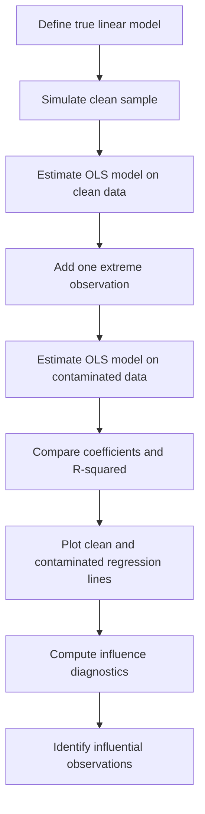

# Problem 2b — Simulation of Outlier Sensitivity in Linear Regression

<p align="center">
  <strong>Linear Regression · OLS Sensitivity · Influence Diagnostics · Cook's Distance · Statistical Modeling</strong>
</p>

---

## Abstract

This project studies the sensitivity of ordinary least squares regression to an influential outlier. A clean sample is first generated from a simple linear data-generating process. Then one extreme observation is added to the dataset to examine how the fitted regression line, coefficient estimates, and influence diagnostics change.

The purpose is to demonstrate that OLS regression can be highly sensitive to unusual observations, especially when a point has both high leverage and a large residual.

The central result is:

> One strategically placed extreme observation can substantially change the estimated intercept, slope, goodness of fit, and diagnostic profile of a linear regression model.

---

## 1. Statistical Motivation

Ordinary least squares estimates regression coefficients by minimizing the sum of squared residuals. Because residuals are squared, observations with large deviations from the fitted line can have a disproportionately large effect on the estimated model.

An observation becomes especially influential when it combines two properties:

1. **High leverage** — its predictor value is far from the center of the sample.
2. **Large residual** — its observed response is far from the value predicted by the fitted model.

This project uses simulation to show how a single extreme point can pull the regression line away from the pattern supported by the clean data.

---

## 2. True Data-Generating Process

The clean sample is generated from the simple linear regression model:

```math
Y_i = \alpha + \beta X_i + \varepsilon_i.
```

The true parameters are:

```math
\alpha = 1,
\qquad
\beta = 3.
```

The predictor and disturbance term are simulated as:

```math
X_i \sim \mathrm{Uniform}(0,5),
\qquad
\varepsilon_i \sim N(0,\sigma^2).
```

The simulation uses:

| Parameter | Value |
|---|---:|
| True intercept, $\alpha$ | 1.0 |
| True slope, $\beta$ | 3.0 |
| Error standard deviation, $\sigma$ | 1.0 |
| Clean sample size, $n$ | 30 |
| Random seed | 42 |

The clean sample gives a benchmark setting in which the fitted OLS line should be close to the true regression line.

---

## 3. Clean Model Specification

The clean model estimates:

```math
Y_i = \hat{\alpha}_{clean} + \hat{\beta}_{clean}X_i + \hat{\varepsilon}_i.
```

Using the clean sample, the estimated coefficients are:

| Quantity | Value |
|---|---:|
| True intercept | 1.000000 |
| Estimated intercept, clean sample | 1.196146 |
| True slope | 3.000000 |
| Estimated slope, clean sample | 2.970530 |

The clean regression is close to the true data-generating process. The estimated slope is near the true value of 3.0.

---

## 4. Contaminated Sample Design

One manually chosen extreme point is added to the clean dataset:

```math
(X_{new}, Y_{new}) = (8,5).
```

This point is unusual for two reasons:

1. Its $X$ value is outside the original simulated range of $X_i \sim \mathrm{Uniform}(0,5)$.
2. Its $Y$ value does not follow the strong positive linear trend implied by the clean data.

The contaminated sample therefore contains 31 observations:

```math
n_{contaminated} = 31.
```

The contaminated model estimates:

```math
Y_i = \hat{\alpha}_{contaminated} + \hat{\beta}_{contaminated}X_i + \hat{\varepsilon}_i.
```

---

## 5. Main Coefficient Results

After adding the extreme observation, the coefficient estimates shift strongly.

| Quantity | Value |
|---|---:|
| True intercept | 1.000000 |
| Estimated intercept, clean sample | 1.196146 |
| Estimated intercept, contaminated sample | 3.873965 |
| True slope | 3.000000 |
| Estimated slope, clean sample | 2.970530 |
| Estimated slope, contaminated sample | 1.849687 |

The added point increases the intercept and decreases the slope.

The coefficient changes are:

```math
\Delta \hat{\alpha}
=
\hat{\alpha}_{contaminated}
-
\hat{\alpha}_{clean}
=
2.677818.
```

```math
\Delta \hat{\beta}
=
\hat{\beta}_{contaminated}
-
\hat{\beta}_{clean}
=
-1.120843.
```

This confirms that the added point is not merely unusual. It is influential enough to materially change the estimated regression relationship.

---

## 6. Model Fit Comparison

The clean regression produces a strong linear fit:

| Model | Observations | Estimated Intercept | Estimated Slope | R-squared |
|---|---:|---:|---:|---:|
| Clean sample | 30 | 1.196146 | 2.970530 | 0.968 |
| Contaminated sample | 31 | 3.873965 | 1.849687 | 0.513 |

The R-squared falls from 0.968 to 0.513 after adding one extreme point.

This shows that the contaminated observation changes both:

1. the fitted regression line,
2. the apparent explanatory power of the model.

---

## 7. Influence Diagnostics

The contaminated regression is evaluated using formal influence diagnostics from `statsmodels`.

The main diagnostic quantities are:

| Diagnostic | Meaning |
|---|---|
| Leverage / hat value | Measures how unusual an observation is in predictor space |
| Studentized residual | Measures how large the residual is after standardization |
| Cook's distance | Measures the overall influence of an observation on the fitted model |
| DFFITS | Measures how much the fitted value changes when the observation is removed |
| DFBETAS | Measures how much each coefficient changes when the observation is removed |

The most influential observation is the added extreme point:

| Observation | Hat Value | Studentized Residual | Cook's Distance |
|---:|---:|---:|---:|
| 30 | 0.315070 | -20.200750 | 6.241774 |

Observation 30 is the manually added point:

```math
(X_{30},Y_{30}) = (8,5).
```

It has high leverage, an extremely large studentized residual, and a Cook's distance far larger than the other observations.

This confirms that the point is highly influential.

---

## 8. Mathematical Interpretation

OLS chooses coefficients by minimizing the residual sum of squares:

```math
\min_{\alpha,\beta}
\sum_{i=1}^{n}
\left(Y_i - \alpha - \beta X_i\right)^2.
```

Because the residuals are squared, a point with a large residual contributes heavily to the objective function.

The leverage value for observation $i$ is the $i$th diagonal element of the hat matrix:

```math
h_{ii}
=
x_i^T(X^TX)^{-1}x_i.
```

A high-leverage point has an unusual predictor value relative to the rest of the sample. But leverage alone does not guarantee influence. A point becomes highly influential when it also has a large residual.

Cook's distance summarizes this combined effect:

```math
D_i
=
\frac{r_i^2}{p \cdot \mathrm{MSE}}
\frac{h_{ii}}{(1-h_{ii})^2},
```

where:

| Symbol | Meaning |
|---|---|
| $D_i$ | Cook's distance for observation $i$ |
| $r_i$ | residual for observation $i$ |
| $p$ | number of estimated parameters |
| $\mathrm{MSE}$ | mean squared error |
| $h_{ii}$ | leverage value |

In this project, the added observation has both a large residual and high leverage, which explains its large Cook's distance.

---

## 9. Computational Workflow



---

## 10. Python Implementation

```python
import numpy as np
import pandas as pd
import matplotlib.pyplot as plt
import statsmodels.api as sm

plt.rcParams["figure.figsize"] = (10, 6)
pd.set_option("display.precision", 6)


# Baseline simulation settings
alpha_true = 1.0
beta_true = 3.0
sigma = 1.0

n = 30
seed = 42


def simulate_clean_sample(n, seed, alpha, beta, sigma):
    rng = np.random.default_rng(seed)

    X = rng.uniform(0, 5, n)
    e = rng.normal(0, sigma, n)
    Y = alpha + beta * X + e

    df = pd.DataFrame({"X": X, "Y": Y})
    return df


def fit_simple_ols(df):
    X_reg = sm.add_constant(df["X"])
    model = sm.OLS(df["Y"], X_reg).fit()
    return model


# Generate clean sample and fit baseline regression
df_clean = simulate_clean_sample(
    n=n,
    seed=seed,
    alpha=alpha_true,
    beta=beta_true,
    sigma=sigma,
)

model_clean = fit_simple_ols(df_clean)

print("=== Clean sample regression ===")
print(model_clean.summary())


# Add one influential leverage point
x_extreme = 8.0
y_extreme = 5.0

df_contaminated = pd.concat(
    [
        df_clean,
        pd.DataFrame({"X": [x_extreme], "Y": [y_extreme]}),
    ],
    ignore_index=True,
)

model_contaminated = fit_simple_ols(df_contaminated)

print("=== Contaminated sample regression ===")
print(model_contaminated.summary())


# Compare coefficient estimates
comparison = pd.DataFrame(
    {
        "Quantity": [
            "True intercept",
            "Estimated intercept (clean sample)",
            "Estimated intercept (contaminated sample)",
            "True slope",
            "Estimated slope (clean sample)",
            "Estimated slope (contaminated sample)",
        ],
        "Value": [
            alpha_true,
            model_clean.params["const"],
            model_contaminated.params["const"],
            beta_true,
            model_clean.params["X"],
            model_contaminated.params["X"],
        ],
    }
)

print(comparison)


# Plot both regression lines
x_grid = np.linspace(
    df_contaminated["X"].min(),
    df_contaminated["X"].max(),
    200,
)

y_clean_fit = (
    model_clean.params["const"]
    + model_clean.params["X"] * x_grid
)

y_cont_fit = (
    model_contaminated.params["const"]
    + model_contaminated.params["X"] * x_grid
)

plt.scatter(df_clean["X"], df_clean["Y"], label="Clean sample")
plt.scatter(
    x_extreme,
    y_extreme,
    color="red",
    s=80,
    label="Added extreme point",
)

plt.plot(x_grid, y_clean_fit, label="OLS line: clean sample")
plt.plot(x_grid, y_cont_fit, label="OLS line: contaminated sample")

plt.xlabel("X")
plt.ylabel("Y")
plt.title("Effect of an Extreme Observation on the Fitted Regression Line")
plt.legend()
plt.grid(True)
plt.show()


# Influence diagnostics for contaminated model
influence = model_contaminated.get_influence()
influence_df = influence.summary_frame()

influence_df = influence_df.reset_index().rename(
    columns={"index": "Observation"}
)

top_influential = influence_df.sort_values(
    "cooks_d",
    ascending=False,
)[
    [
        "Observation",
        "hat_diag",
        "student_resid",
        "cooks_d",
    ]
].head(10)

print(top_influential)


# Influence plot
fig = sm.graphics.influence_plot(
    model_contaminated,
    criterion="cooks",
    alpha=0.6,
)

fig.tight_layout(pad=1.0)
plt.show()


# Quantify coefficient changes
delta_intercept = (
    model_contaminated.params["const"]
    - model_clean.params["const"]
)

delta_slope = (
    model_contaminated.params["X"]
    - model_clean.params["X"]
)

print("Change in intercept:", round(delta_intercept, 6))
print("Change in slope:", round(delta_slope, 6))
```

---

## 11. Visualization

The project produces two main visual diagnostics.

### Regression Line Comparison

The first plot compares:

- the clean sample,
- the added extreme point,
- the OLS line from the clean sample,
- the OLS line from the contaminated sample.

The visual result shows that the extreme point pulls the fitted regression line downward, reducing the estimated slope.

### Influence Plot

The second plot combines:

- leverage on the horizontal axis,
- studentized residuals on the vertical axis,
- Cook's distance through bubble size.

The added point appears as the dominant influential observation because it has both high leverage and a large residual.

---

## 12. Statistical Interpretation

The clean sample supports the intended positive linear relationship:

```math
\hat{\beta}_{clean} = 2.970530.
```

This is close to the true slope:

```math
\beta = 3.
```

After contamination, the estimated slope becomes:

```math
\hat{\beta}_{contaminated} = 1.849687.
```

The change in slope is:

```math
\Delta \hat{\beta} = -1.120843.
```

The added point weakens the estimated relationship between $X$ and $Y$ even though the underlying data-generating process has not changed.

This shows that OLS estimates are not only determined by the majority pattern in the data. They can also be strongly shaped by a small number of high-influence observations.

---

## 13. Financial Engineering Relevance

Outlier sensitivity is important in financial engineering because financial datasets often contain extreme observations.

Examples include:

| Financial Context | Outlier or Influential Observation | Potential Consequence |
|---|---|---|
| Return modeling | Crash day or short squeeze | Distorted expected return estimate |
| Volatility modeling | Crisis-period spike | Inflated or unstable volatility coefficient |
| Credit modeling | Rare default event | Distorted default-risk relationship |
| Factor modeling | Extreme factor realization | Misestimated factor loading |
| Portfolio optimization | Outlying return observation | Unstable covariance and allocation weights |
| Risk management | Tail-loss event | Excessive sensitivity of VaR or stress estimates |
| ESG / climate finance | Extreme carbon-price shock | Distorted transition-risk sensitivity |

In quantitative finance, influential observations are not always data errors. They may represent real market stress events. The modeling decision is therefore not simply whether to delete them. The analyst must decide whether the point is:

1. an error,
2. a rare but valid event,
3. a regime change,
4. a stress scenario,
5. a signal of model misspecification.

This is why influence diagnostics are important for model validation and risk interpretation.

---

## 14. Model Risk Interpretation

From a model-risk perspective, the extreme observation creates **estimation instability**.

A single point changes:

- the estimated intercept,
- the estimated slope,
- the visual regression line,
- the R-squared,
- the diagnostic profile of the model.

This matters because a model may appear statistically valid while being driven by a small number of influential observations.

In financial decision systems, this can lead to:

- unstable hedge ratios,
- distorted beta estimates,
- biased risk-factor exposures,
- poor stress-test interpretation,
- fragile portfolio allocations,
- misleading regression-based forecasts.

A robust financial engineering workflow should therefore include:

- residual diagnostics,
- leverage analysis,
- Cook's distance,
- studentized residuals,
- comparison of clean and contaminated estimates,
- sensitivity analysis,
- robustness checks.

---

## 15. Engineering Interpretation

From an engineering systems perspective, the extreme point is an abnormal input-output state. It lies outside the main operating range of the system and does not follow the dominant signal pattern.

```text
Clean System Behavior
├── X values mostly between 0 and 5
├── Y follows a positive linear relationship
└── OLS line approximates the true process

Contaminated System Behavior
├── One added point at X = 8
├── Y value is far below the original trend
└── OLS line shifts toward the abnormal point
```

The result is a model that no longer represents the main operating regime as cleanly.

This is similar to an engineering calibration problem where one abnormal measurement can distort the fitted response curve.

---

## 16. Project Structure

```text
problem-2b-outlier-sensitivity/
├── README.md
├── notebook/
│   └── Problem_2b_outlier_sensitivity.ipynb
├── html/
│   └── Problem_2b_outlier_sensitivity.html
├── figures/
│   ├── regression_line_comparison.png
│   └── influence_plot.png
└── results/
    ├── coefficient_comparison.csv
    └── influence_diagnostics.csv
```

Recommended outputs:

| Folder | Purpose |
|---|---|
| `notebook/` | Main Jupyter notebook |
| `html/` | Rendered notebook for review |
| `figures/` | Regression and influence plots |
| `results/` | Exported tables and diagnostics |

---

## 17. Key Results

| Result | Interpretation |
|---|---|
| Clean slope = 2.970530 | Close to the true slope of 3.0 |
| Contaminated slope = 1.849687 | Strong downward distortion |
| Change in slope = -1.120843 | The added point materially changes the model |
| Clean R-squared = 0.968 | Strong fit under clean data |
| Contaminated R-squared = 0.513 | Fit deteriorates after contamination |
| Cook's distance for added point = 6.241774 | The added point is highly influential |
| Studentized residual for added point = -20.200750 | The added point has an extreme residual |
| Hat value for added point = 0.315070 | The added point has high leverage |

---

## 18. Main Conclusion

This project demonstrates that ordinary least squares regression can be highly sensitive to influential observations.

The clean sample produces an estimated slope close to the true value:

```math
\hat{\beta}_{clean} = 2.970530
\approx
3.
```

After adding one extreme point:

```math
(X_{new},Y_{new}) = (8,5),
```

the slope falls to:

```math
\hat{\beta}_{contaminated} = 1.849687.
```

The change in slope is:

```math
\Delta \hat{\beta} = -1.120843.
```

The influence diagnostics confirm that the added point has high leverage, an extreme studentized residual, and a large Cook's distance.

The main lesson is:

> OLS regression can be dominated by a small number of influential observations.  
> Model validation should include influence diagnostics, not only coefficient estimates and R-squared.

---

## Author

**Dossiya Dakou**  
MSc Financial Engineering — WorldQuant University  
Master of Science in Engineering, Sustainable Engineering — Arizona State University
